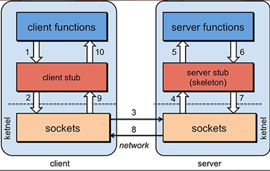

# dubbo入门

## 一、RPC

### 1、什么是RPC

RPC【Remote Procedure Call】是指远程过程调用，是一种进程间通信方式，他是一种技术的思想，而不是规范。它允许程序调用另一个地址空间（通常是共享网络的另一台机器上）的过程或函数，而不用程序员显式编码这个远程调用的细节。即程序员无论是调用本地的还是远程的函数，本质上编写的调用代码基本相同。

### 2、RPC原理




**RPC两个核心模块：通讯，序列化。**

### 3、调用流程

一次完整的RPC调用流程（同步调用，异步另说）如下：

> **1）服务消费方（client）调用以本地调用方式调用服务；** 
>
> 2）client stub接收到调用后负责将方法、参数等组装成能够进行网络传输的消息体； 
>
> 3）client stub找到服务地址，并将消息发送到服务端； 
>
> 4）server stub收到消息后进行解码； 
>
> 5）server stub根据解码结果调用本地的服务； 
>
> 6）本地服务执行并将结果返回给server stub； 
>
> 7）server stub将返回结果打包成消息并发送至消费方； 
>
> 8）client stub接收到消息，并进行解码； 
>
> **9）服务消费方得到最终结果。**
>
> RPC框架的目标就是要2~8这些步骤都封装起来，这些细节对用户来说是透明的，不可见的。


## 二、Dubbo

### 1、简介

Apache Dubbo 是一款高性能、轻量级的开源Java RPC框架，它提供了三大核心能力：**面向接口代理的高性能RPC调用**，**智能容错和负载均衡**、**服务自动注册和发现**、**高度可扩展能力**、**运行期流量调度**、**可视化的服务治理与运维**。官网：http://dubbo.apache.org

### 2、基本概念


**服务提供者（Provider）**：暴露服务的服务提供方，服务提供者在启动时，向注册中心注册自己提供的服务。

**服务消费者（Consumer）**: 调用远程服务的服务消费方，服务消费者在启动时，向注册中心订阅自己所需的服务，服务消费者，从提供者地址列表中，基于软负载均衡算法，选一台提供者进行调用，如果调用失败，再选另一台调用。

**注册中心（Registry）**：注册中心返回服务提供者地址列表给消费者，如果有变更，注册中心将基于长连接推送变更数据给消费者。

**监控中心（Monitor）**：服务消费者和提供者，在内存中累计调用次数和调用时间，定时每分钟发送一次统计数据到监控中心。

### 3、调用关系说明

- 服务容器负责启动，加载，运行服务提供者。

- 服务提供者在启动时，向注册中心注册自己提供的服务。

- 服务消费者在启动时，向注册中心订阅自己所需的服务。

- 注册中心返回服务提供者地址列表给消费者，如果有变更，注册中心将基于长连接推送变更数据给消费者。

- 服务消费者，从提供者地址列表中，基于软负载均衡算法，选一台提供者进行调用，如果调用失败，再选另一台调用。

- 服务消费者和提供者，在内存中累计调用次数和调用时间，定时每分钟发送一次统计数据到监控中心。

### 4、环境搭建

#### 4.1、安装zookeeper

#### 4.1、配置zookeeper

### 5、与spring boot整合

在 provider 和 consumer 中增加 dubbo 和 zookeeper 客户端 jar 包依赖：

```xml
<!-- 引入dubbo-starter -->
<dependency>
    <groupId>org.apache.dubbo</groupId>
    <artifactId>dubbo-spring-boot-starter</artifactId>
    <version>2.7.4.1</version>
</dependency>
<!-- 由于我们使用zookeeper作为注册中心， -->
<dependency>
    <groupId>org.apache.zookeeper</groupId>
    <artifactId>zookeeper</artifactId>
    <version>3.5.6</version>
</dependency>
```

application.properties 中配置

```
# 超时时间 单位毫秒
dubbo.config-center.timeout=60000;
# 包扫描路径
dubbo.scan.base-packages=com.vip8.itemcenter.service,com.vip8.flownumber.service;
# 服务名称
dubbo.application.name=itemcenter;

dubbo.consumer.check=false;
# 协议名称
dubbo.protocol.name=dubbo;
# 协议端口
dubbo.protocol.port=20880;
# 配置中心地址
dubbo.config-center.address=zookeeper://dev.zookeeper.xinc818.com:2181;
# 注册中心地址
dubbo.registry.address=zookeeper://dev.zookeeper.xinc818.com:2181;

dubbo.registry.check=false;
dubbo.registry.register=false;
```


