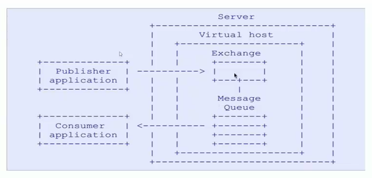

# RabbitMQ入门

## 1. MQ引言

### 1.1 什么是MQ 

​		MQ（Message Quene）：翻译为**消息队列**，通过典型的**生产者**和**消费者**模型，生产者不断向消息队列中生产消息，消费者不断的从队列中获取消息。因为消息的生产和消费都是异步的，而且只关心消息的发送和接收，没有业务逻辑的侵入，轻松的实现系统间解耦。别名为消息中间件通过利用高效可靠的消息传递机制进行平台无关的数据交流，并基于数据通信来进行分布式系统的集成。

### 1.2 MQ有哪些

​		当今市面上有很多主流的消息中间件，如老牌的ActiveMQ、RabbitMQ，炙手可热的Kafka，阿里巴巴自主开发RocketMQ等。

### 1.3 不同MQ特点

```markdown
# 1.ActiveMQ 
	ActiveMQ是Apache出品，最流行的，能力强劲的开源消息总线。它是一个完全支持JMS规范的的消息中间件。丰富的API，多种集群架构模式让ActiveMQ在业界成为老牌的消息中间件，在中小型企业颜受欢迎！

# 2.Kafka 
	Kafka是LinkedIn开源的分布式发布-订阅消息系统，目前归属于Apache顶级项目。Kafka主要特点是基于Pu11的模式来处理消息消费，追求高吞吐量，一开始的目的就是用于日志收集和传输。e.8版本开始支持复制，不支持事务，对消息的重复、丢失、错误没有严格要求，适合产生大量数据的互联网服务的数据收集业务。

# 3.RocketMQ 
	RocketMQ是阿里开源的消息中间件，它是纯Java开发，具有高吞吐量、高可用性、适合大规模分布式系统应用的特点。RocketMQ思路起源于Kafka，但并不是Kafka的一个Copy，它对消息的可靠传输及事务性做了优化，目前在阿里集团被广泛应用于交易、充值、流计算、消息推送、日志流式处理、bing1og分发等场景。

# 4.RabbitMQ 
	RabbitMQ是使用Er1ang语言开发的开源消息队列系统，基于AMQP协议来实现。AMQP的主要特征是面向消息、队列、路由（包括点对点和发布/订阅）、可靠性、安全。AMQP协议更多用在企业系统内对数据一致性、稳定性和可靠性要求很高的场景，对性能和吞吐量的要求还在其次。
```

>RabbitMQ比Kafka可靠，Kafka更适合IO高吞吐的处理，一般应用在大数据日志处理或对实时性（少量延迟），可靠性（少量丢数据）要求稍低的场景使用，比如ELK日志收集。

## 2. RabbitMQ引言

### 2.1 RabbitMQ

>基于AMQP协议，erlang语言开发，是部署最广泛的开源消息中间件，是最受欢迎的开源消息中间件之一

**官网：https://www.rabbitmq.com/**

**官方教程：https://www.rabbitmq.com/#getstarted**

```markdown
# AMQP协议
	AMQP（advanced message queuing protoco1）在2003年时被提出，最早用于解决金融领不同平台之间的消息传递交互问题。顾名思义，AMQP是一种协议，更准确的说是一种binary wire-1evel protocol（链接协议）。这是其和JMS的本质差别，AMQP不从API层进行限定，而是直接定义网络交换的数据格式。这使得实现了AMQP的provider天然性就是跨平台的。以下是AMQP协议模型：
```



### 2.2 RabbitMQ的安装

